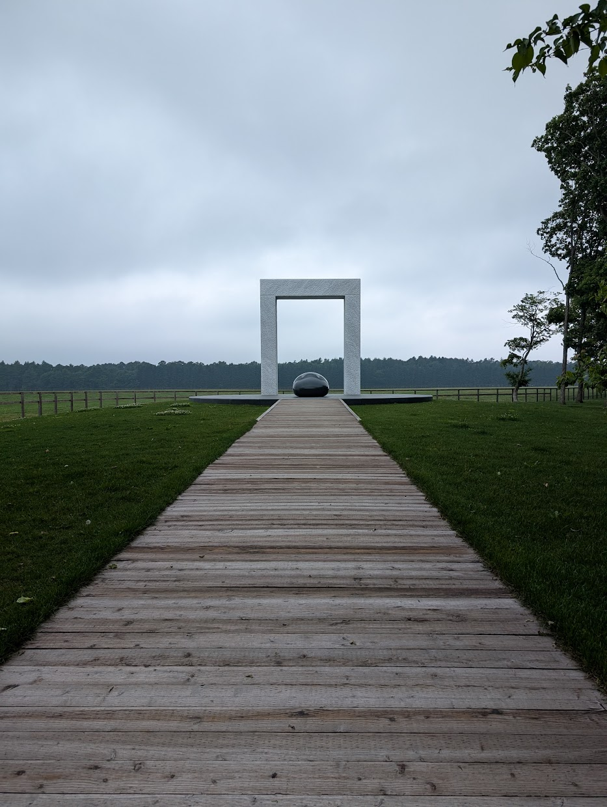
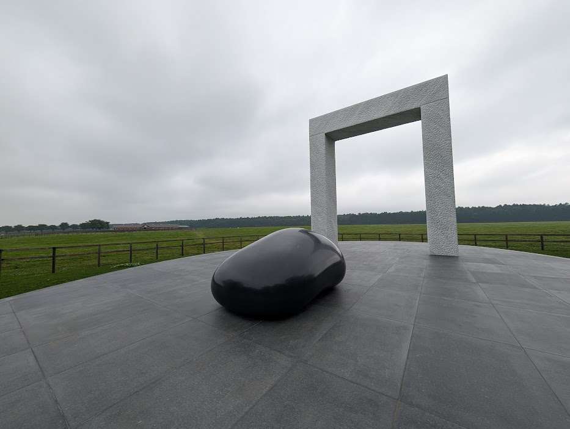

import CaptionedImage from '../../../../components/CaptionedImage.astro';
import ImageGrid from '../../../../components/ImageGrid.astro';
import shuttleBusImage from './PXL_20250706_011831975.jpg';
import stableImage from './PXL_20250706_023359426.jpg';
import goldenSixtyImage1 from './PXL_20250706_044753439.jpg';
import goldenSixtyImage2 from './PXL_20250706_044656308.jpg';
import goldenSixtyImage3 from './PXL_20250706_044622464.jpg';
import goldenSixtyImage4 from './PXL_20250706_044721727.jpg';
import windInHerHairImage1 from './PXL_20250706_022006683.jpg';
import windInHerHairImage2 from './PXL_20250706_044457554.jpg';
import buenaVistaImage from './PXL_20250706_022602209.jpg';
import cesarioImage from './PXL_20250706_022608898.jpg';
import realStealImage from './PXL_20250706_022701909.MP.jpg';
import satonoDiamondImage from './PXL_20250706_023011628.jpg';
import ponyImage1 from './PXL_20250706_020150388.jpg';
import ponyImage2 from './PXL_20250706_021212764.jpg';
import ponyImage3 from './PXL_20250706_020724799.jpg';

2025/07/06、マイル稼ぎを兼ねて北海道のノーザンホースパークへ行ってきた。

## アクセス

https://www.northern-horsepark.jp/access/

新千歳空港から車で15～20分程度の場所にあり、いわゆる「ノーザンファーム空港牧場」の至近である。

グリーンチャンネルを見ていると「生産者は安平のノーザンファーム」みたいなフレーズを何度も耳にすると思うが、その安平町との境目に位置し、競走馬の生産が非常に盛んな地域だ。

基本的に車でのアクセスが前提となるが、新千歳空港からシャトルバスが出ており、今回はそちらを利用した。

<CaptionedImage
  src={shuttleBusImage}
  alt="ノーザンホースパーク行きのシャトルバス"
  caption="新千歳空港から運行されているシャトルバス (無料・予約不要)"
  width={800}
  height={600}
/>

空港の乗降場所が非常に分かりにくいが、国内線ターミナルJAL側の端にある交番を探し、その更に奥に入った、レンタカー屋のシャトルバスが多く出入りしているエリアとなる。
バスが到着する乗り場番号は固定されておらず、貸し切りバス用の空きスペースに順次駐車する形となるので、ノーザンホースパークのロゴの入ったバスが入ってくるのを探して探して追いかけることになる。

利用自体は無料で、事前予約も不要だ。

## 厩舎見学

ここを訪れる競馬好きの目的は、殆どの場合引退馬の見学だろう。

キンシャサノキセキ、オーソリティ、ブラストワンピース...など、数々の名馬がここで余生を過ごしている。

<CaptionedImage
  src={stableImage}
  alt="厩舎見学停止の案内"
  caption="セレクトセール準備のため、多くの厩舎が立ち入り禁止になっていた"
  width={800}
  height={600}
/>

ただ、私が訪問したときはセレクトセールの準備作業のため、多くの厩舎が立ち入り禁止状態になっていた。

ここは正直タイミングを間違えたかもしれない。

見学可能だった有名馬としては、ゴールデンシックスティとウインドインハーヘアがいた。

<ImageGrid
  images={[
    {
      src: goldenSixtyImage1,
      alt: 'ゴールデンシックスティ',
      caption: '',
    },
    {
      src: goldenSixtyImage4,
      alt: '洗い場のゴールデンシックスティ',
      caption: '',
    },
    {
      src: goldenSixtyImage2,
      alt: '洗い場のゴールデンシックスティ',
      caption: '',
    },
    {
      src: goldenSixtyImage3,
      alt: '洗い場のゴールデンシックスティ',
      caption: '',
    },
  ]}
  columns={2}
/>

<ImageGrid
  images={[
    {
      src: windInHerHairImage1,
      alt: 'ウインドインハーヘア',
      caption: '',
    },
    {
      src: windInHerHairImage2,
      alt: 'ウインドインハーヘア',
      caption: '',
    },
  ]}
/>

ゴールデンシックスティはちょうど洗い場におり、G1を10勝し30億近くの賞金を稼いだ超名馬を間近で見ることができた。

## ホースギャラリー

<ImageGrid
  images={[
    {
      src: buenaVistaImage,
      alt: 'ブエナビスタ',
      caption: 'ブエナビスタ',
    },
    {
      src: cesarioImage,
      alt: 'シーザリオ',
      caption: 'シーザリオ',
    },
    {
      src: realStealImage,
      alt: 'リアルスティール',
      caption: '伝説の名馬リアルスティール',
    },
    {
      src: satonoDiamondImage,
      alt: 'サトノダイヤモンド',
      caption: 'サトノダイヤモンド (概念)',
    },
  ]}
/>

## ポニーショー

<ImageGrid
  images={[
    {
      src: ponyImage1,
      alt: 'ポニーショー',
      caption: '',
    },
    {
      src: ponyImage2,
      alt: 'ポニーショー',
      caption: '',
    },
    {
      src: ponyImage3,
      alt: 'ポニーショー',
      caption: '',
    },
  ]}
/>

ポニーショーで良い表情を見せていたこのポニー、なんと[コンサドーレ札幌のFWとして選手登録されている](https://www.consadole-sapporo.jp/team/topteam/detail/29/)らしい。

## ディープインパクトゲート

