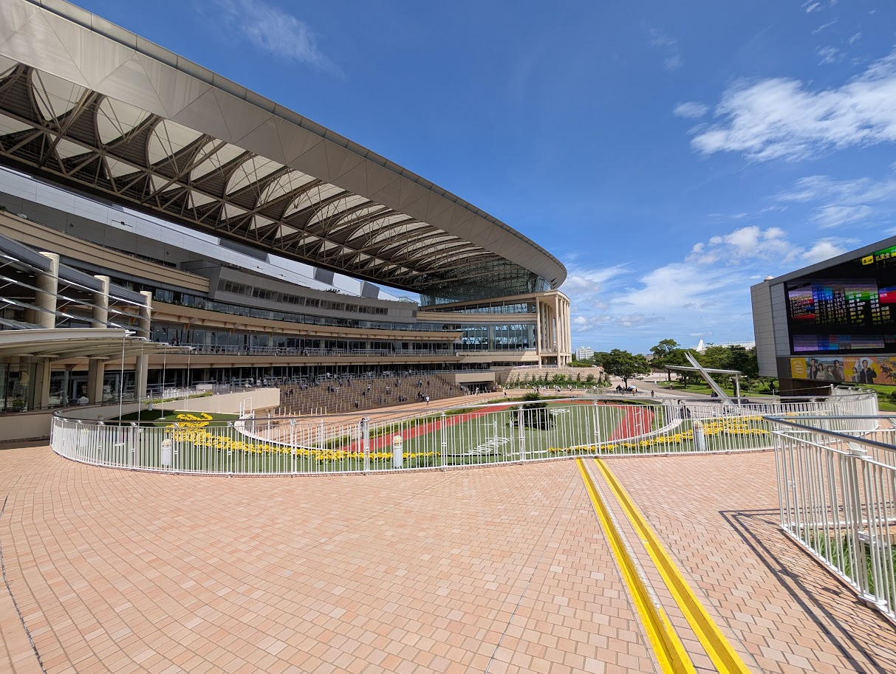

import ImageGrid from '../../../../components/ImageGrid.astro';

# 小倉競馬場

2025/07/19 ～ 2025/07/20 にかけて、小倉競馬場へ行ってきた。

大学生時代は北九州に住んでいたのだが、同時は全く競馬に興味がなく、小倉競馬場へ来るのは今回が初めて。

import kokuraGoalPost from './DSC02632.JPG';
import kokuraccha from './PXL_20250719_054359318.jpg';
import fromStation from './PXL_20250720_071552047.jpg';
import umemusubi from './DSC02769.JPG';

<ImageGrid
  images={[
    {
      src: kokuraGoalPost,
      alt: 'ゴールポスト',
      caption: 'ゴールポスト',
    },
    {
      src: fromStation,
      alt: 'モノレール駅から望む競馬場',
      caption: 'モノレール駅から望む競馬場',
    },
  ]}
  columns={2}
/>

モノレール駅直結、かつ距離も非常に近く、アクセスは良好。

ただ、4両編成の車両では重賞日の客を捌ききれないのか、帰宅ラッシュ時は駅への入場制限も行われていた。

<ImageGrid
  images={[
    {
      src: kokuraccha,
      alt: 'コクラッチャ',
      caption: 'コクラッチャ',
    },
    {
      src: umemusubi,
      alt: '誘導馬ウメムスビ',
      caption: '誘導馬ウメムスビ',
    },
  ]}
/>

## レースの写真

import domane from './DSC02660~2.JPG';
import namuraDelon from './original_78300a79-bf94-452c-8585-c74d0f185440_DSC02823.JPG';
import angelitas from './DSC03355~2.JPG';
import englandEyes from './DSC04547~2.JPG';

<ImageGrid
  images={[
    {
      src: domane,
      alt: 'ドマーネ',
      caption: 'ドマーネ & 国分恭介騎手 ゴールドシップxランドネの許嫁配合',
    },
    {
      src: namuraDelon,
      alt: 'ナムラドロン',
      capton: 'ナムラドロン & 松山弘平騎手 ダノンスマッシュ産駒初勝利',
    },
    {
      src: angelitas,
      alt: 'アンヘリータス',
      caption: 'アンヘリータス & 川田将雅騎手 ひまわり賞 (九州産馬限定)',
    },
    {
      src: englandEyes,
      alt: 'イングランドアイズ',
      caption: 'イングランドアイズ & 松若風馬騎手 小倉記念',
    },
  ]}
/>

## ベレシート

今回のメインのお目当ては、クロノジェネシスの初仔であるベレシート。

<iframe
  width="560"
  height="315"
  src="https://www.youtube.com/embed/uYmR378Y1-k?si=aXbwLW6MMSFo_gHk"
  title="YouTube video player"
  frameborder="0"
  allow="accelerometer; autoplay; clipboard-write; encrypted-media; gyroscope; picture-in-picture; web-share"
  referrerpolicy="strict-origin-when-cross-origin"
  allowfullscreen
></iframe>

import bereshit01 from './DSC03688~2.JPG';
import bereshit02 from './original_40bfbe56-9ea2-478d-90bf-5c0711623b3c_DSC03918.JPG';
import bereshit03 from './DSC03869.JPG';
import bereshit04 from './DSC03935.JPG';

<ImageGrid
  images={[
    {
      src: bereshit01,
    },
    {
      src: bereshit02,
    },
    {
      src: bereshit03,
    },
    {
      src: bereshit04,
    },
  ]}
/>

スタートで出遅れ、さらに躓いたときには思わず「あっ」という声が出たが、終わってみれば最終直線だけで他馬を抜き去る圧勝。

気が早いかもしれないが、来年のクラシック戦線を賑わせることを期待したい。
