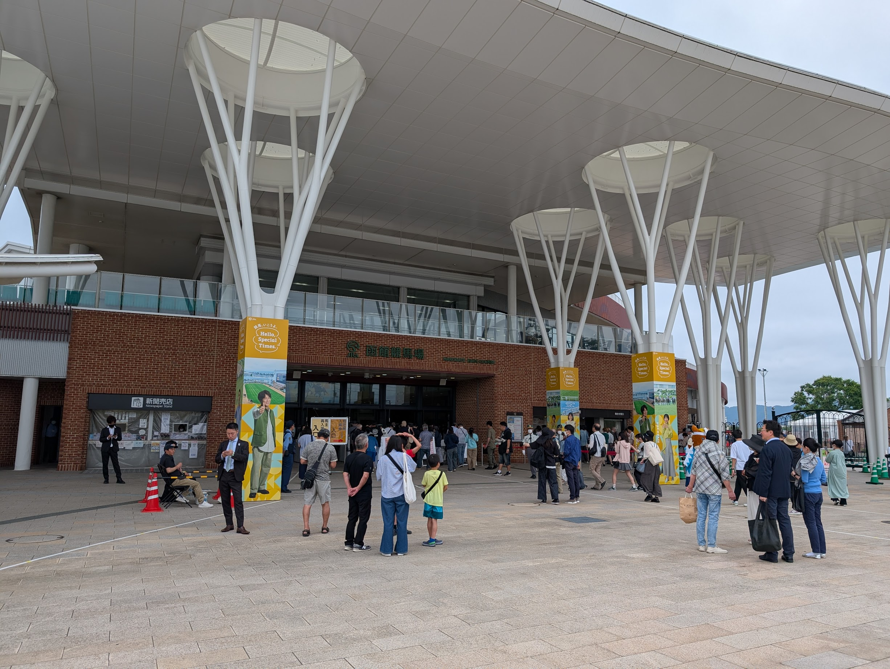
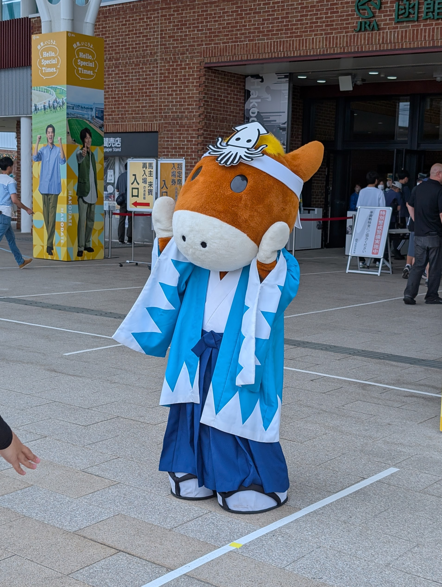
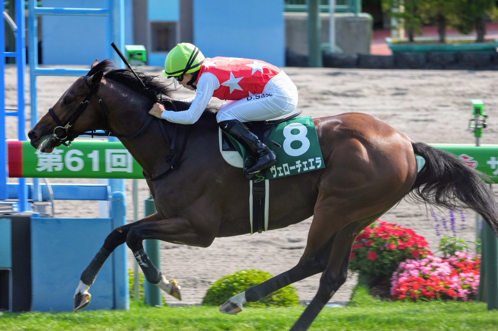
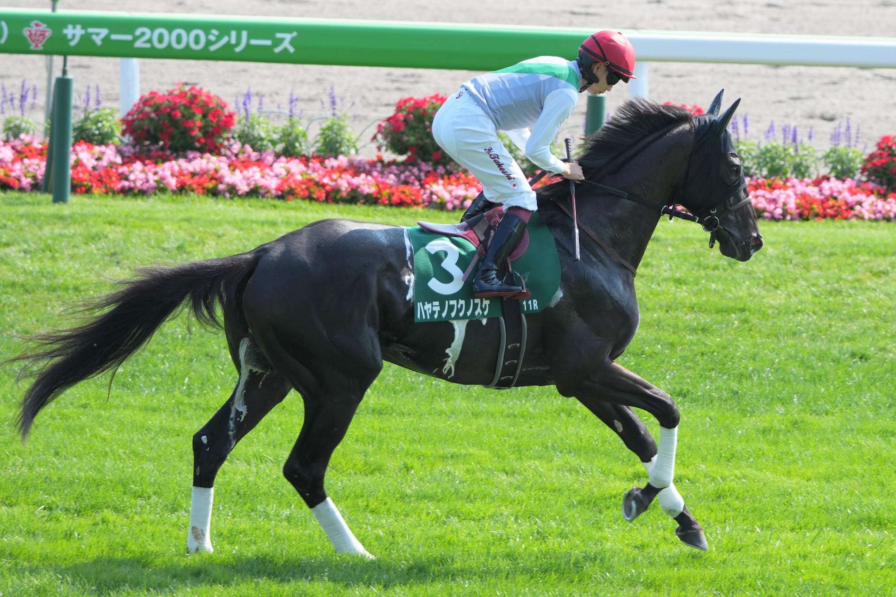

2025/06/29 (日)、マイル修行も兼ねて函館競馬場へ行ってきた。

函館らしく、ターフィーくんも新撰組仕様である。

メインレースの函館記念は、ヴェローチェエラ & 佐々木大輔騎手がコースレコードで勝利。

函館2000mのレコードと言えばピンとくる競馬好きも多いであろう、あの[サッカーボーイ](https://db.netkeiba.com/horse/1985103538/)の不滅のレコードが実に37年ぶりに更新されたのである。
現地でアナウンスされた瞬間、思わず「嘘ぉ」と声を上げてしまった。

なお、私の本命はというと、青森県産馬・ウインバリアシオン産駒である[ハヤテノフクノスケ](https://db.netkeiba.com/horse/2021109070/)。
惜しくも2着で重賞初制覇とはならなかったが、賞金の加算に成功。

レースの選択肢が広がったところだと思うので、これからの活躍に期待したい。
